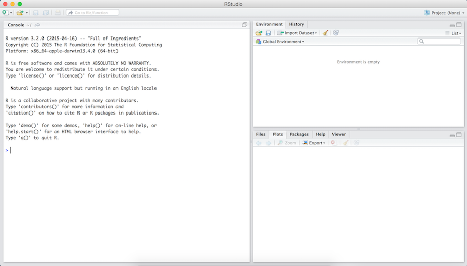

## Materials

* Slides at http://bit.ly/reproduce_uscots15_slides
* All source code at http://bit.ly/reproduce_uscots15_git
* *Very* useful resources from RStudio:
    * [RMarkdown cheat sheet](http://www.rstudio.com/wp-content/uploads/2015/02/rmarkdown-cheatsheet.pdf)
    * Others at http://www.rstudio.com/resources/cheatsheets
        * ggplot2: for visualization
        * dplyr: for data manipulation
        * ...


## Acknowledgements

Some of the materials are result of the NSF supported [Reproducible Science Curriculum Hackathon](https://github.com/Reproducible-Science-Curriculum/Reproducible-Science-Hackathon-Dec-08-2014) that was held December 8-11, 2014, at the National Evolutionary Synthesis Center ([NESCent](http://nescent.org/)) in Durham, NC.

Look for a workshop coming soon near you!


        
# Reproducibility: who cares?

## Science retracts gay marriage paper without agreement of lead author LaCour

* Yesterday (!) Science retracted a study of how canvassers can sway people's opinions about gay marriage published just 5 months ago.

* Science Editor-in-Chief Marcia McNutt: Original survey data not made available for independent reproduction of results. + Survey incentives misrepresented. + Sponsorship statement false.

* Two Berkeley grad students who attempted to replicate the study quickly discovered that the data must have been faked.

* Methods we'll discuss today can't prevent this, but they can make it easier to discover issues.

Source: http://news.sciencemag.org/policy/2015/05/science-retracts-gay-marriage-paper-without-lead-author-s-consent


## Seizure study retracted after authors realize data got "terribly mixed"

From the authors of **Low Dose Lidocaine for Refractory Seizures in Preterm Neonates**:

*"The article has been retracted at the request of the authors. After carefully re-examining the data presented in the article, they identified that data of two different hospitals got terribly mixed. The published results cannot be reproduced in accordance with scientific and clinical correctness."*

Source: http://retractionwatch.com/2013/02/01/seizure-study-retracted-after-authors-realize-data-got-terribly-mixed/


## Bad spreadsheet merge kills depression paper, quick fix resurrects it

* The authors informed the journal that the merge of lab results and other survey data used in the paper resulted in an error regarding the identification codes. Results of the analyses were based on the data set in which this error occurred. Further analyses established the results reported in this manuscript and interpretation of the data are not correct. 

* **Original conclusion:** Lower levels of CSF IL-6 were associated with current depression and with future depression [...].

* **Revised conclusion:** Higher levels of CSF IL-6 and IL-8 were associated with current depression [...].

Source: http://retractionwatch.com/2014/07/01/bad-spreadsheet-merge-kills-depression-paper-quick-fix-resurrects-it/


# Reproducibility: why should we care?

## Two-pronged approach

<div class="columns-2">
\#1 
Convince researchers to adopt a reproducible research workflow

<br><br>

\#2
Train new researchers who don’t have any other workflow


</div>


## Changing landscape of stat ed

>- Last night we heard "more analysis of real and complex data + more research"
>- More is good, but **better** is, well, better
>- How about "**better** analysis of real and complex data + **better** research"?


# Outline

* Exercise 1: Motivating reproducibility
* Literate programming
* Revisit Exercise 1: Doing better
* Exercise 2: Extending your analysis
* Next steps... for you
* Next steps... for your teaching


# Exercise 1: Motivating reproducibility

## Data

Download the dataset `gapminder-5060.csv` at http://bit.ly/reproduce_uscots15_gap5060.


## Instructions

**Part 1:** *Analyze + document*

* Load `gapminder-5060.csv` into your statistical analysis package of choice, and complete the following exercise. Write instructions/documentation for your collaborator to reproduce your.
* **Task:** Visualize the relationship between GDP and life expectancy for countries in Europe in 1952.

**Part 2:** *Swap + discuss*

* Swap instructions/documentation with your collaborator, and reproduce their work without any additional instructions. Software mismatch: help them install the necessary software, or walk them through it on your computer to emulate the experience.
* Then, discuss challenges you faced (or didn't face) and why you were or weren't able to reproduce their work.


## Take aways

* What tool(s) did you use?
* Were you able to reproduce?

* Have you ever tried to reproduce someone else's data analysis before?
* Have you ever tried to reproduce your own work before?
* What made it easy/hard for reproducing your parners' work?
* What would have to happen if you had to extend the analysis further?
* If you caught a data error how easy/hard would it be to re-create the analysis?
* What would happen if your collaborator is no longer available to walk you through their analysis?

## PSA

<br><br><br>

<center>
*"You mostly collaborate with yourself,*
<br>
*and me-from-2-months-ago never responds to email."*
<br><br>
Mark Holder
<center>


# Literate programming

## Donald Knuth "Literate Programming (1983)"

"Let us change our traditional attitude to the construction of programs: Instead of imagining that our main task is to instruct a *computer* what to do, let us concentrate rather on explaining to *human beings* what we want a computer to do."

"The practitioner of literate programming [...] strives for a program that is comprehensible because its concepts have been introduced in an order that is best for human understanding, using a mixture of formal and informal methods that reinforce each other."

>- These ideas have been around for years!
>- and tools for putting them to practice have also been around
>- but they have never been as accessible as the current tools


## Reproducibility checklist (abridged)

* Are the tables and figures reproducible from the code and data?
* Does the code actually do what you think it does?
* In addition to what was done, is it clear *why* it was done? (e.g., how were parameter settings chosen?)
* Can the code be used for other data?
* Can you extend the code to do other things?

<br><br><br><br>
(From Karl Broman)


## Ambitious goal + (most likely) novice students

We need an environment where

* data, analysis, and results are tightly connected, or better yet, inseparable

* reproducibility is built in
    * the original data remains untouched
    * all data manipulations and analyses are inherently documented

* documentation is human readable and syntax is minimal


## Toolkit

<center>

</center>


## Why R?

<div class="columns-2">
* Programming language for data analysis
* Free!
* Open source
* Widely used and supported across all disciplines
* Can be used on Windows, Mac OS X, or Linux


</div>


## Why not language X?

* There are a number of other great programming tools out there that can also be used to improve the reproducibility of your analysis
* The key is to use some type of language that will allow you to automate and document your analysis
* Once you master one language you'll probably find it easier to learn another


## Why RStudio?

* RStudio $\ne$ R, it's instead an integrated development environment (IDE) for R
* Gives you a single environment to combine your documentation and your analysis with markdown support
* Runs on top of R
* Gives you a bunch of really cool features, some of which we'll explore throughout the workshop


## Anatomy of RStudio

<center>

</center>


## Anatomy of RStudio (cont.)

* Left: Console
    * Every time you launch RStudio, it will have the same text at the top of the console telling you the version of R that you’re running. 
    * Below that information is the prompt. 
* Upper right: workspace and a history of the commands that you've previously entered
* Lower right: Any plots that you generate + access to files, help, packages


## Recap

<br><br>

<center>

</center>


# Revisit Exercise 1: Doing better

## Accessing RStudio

* **Option 1: I'm new to R/RStudio:** 
    * Go to [URL given in your handout]
    * Username: guest
    * Password: [password given in your handout]
    * This account will work until the end of today

* **Option 2: I already use R/RStudio:** Do you have the **latest** versions of R and RStudio installed locally on your computer?
    * No, or you're not sure $\rightarrow$ Go to Option 1
    * Yes $\rightarrow$ Install and load `knitr`, `ggplot2`, `dplyr`, and `downloader` packages
```{r eval = FALSE}
install.packages("knitr") ; library("knitr")
install.packages("ggplot2") ; library("ggplot2")
install.packages("downloader") ; library("downloader")
install.packages("dplyr") ; library("dplyr")
```   
## Template

Download `ex1-template.Rmd` using the following
```{r eval = FALSE}
download(url = "http://bit.ly/reproduce_uscots15_ex1", destfile = "ex1-template.Rmd")
```
locate it in your Files pane, and compile it by clicking on `Knit HTML`


## Demo

[Walkthrough of the `ex1-template.Rmd` document and output]


## A brief extension

**Task:** Add year 1967 in another color.

1. Create a subset of `gap_5060` for Europe in 1952 **and 1967** and call it `eu_5267`.

```{r eval=FALSE, echo=FALSE}
eu_5267 <- gap_5060 %>%
  filter(continent == "Europe", year %in% c(1952, 1967))
```

2. Create the plot.

```{r eval=FALSE, echo=FALSE}
ggplot(data = eu_5267, aes(x = gdpPercap, y = lifeExp, color = factor(year))) +
  geom_point()  
```


# Exercise 2: Extending your analysis

## Instructions

It's your lucky day, you just got some additional data!

**Tasks:**

1. Append the new data `gapminder-7080.csv` and `gapminder-90plus.csv` to your existing data set. (Be careful as you do so, as the ordering of columns in the data set may not match between the different CSV files!)
2. Create line plots of life expectancy over time for Canada, Mexico, and the United States that run from 1952 to 2007.

**Template:**

Download `ex2-template.Rmd` using the following
```{r eval = FALSE}
download(url = "http://bit.ly/reproduce_uscots15_ex2", destfile = "ex2-template.Rmd")
```
locate it in your Files pane, and compile it by clicking on `Knit HTML`

## Demo

[Walkthrough of the `ex2-template.Rmd` document and output]


## Further extensions

**Task:** Create the same plot as before, but now also include data from Cambodia, China, Japan, Egypt, South Africa, Uganda.


## Take aways

* The analysis is self-documenting
* It's easy to extend or refine analyses by copying and modifying code blocks
* The analysis can be disseminated by providing the RMarkdown file and data sources
* The results can also be shared as HTML (fully self contained), PDF, or Word (gasp!) if just a summary of the analysis is needed


# Next steps... for you

## PSA

<br><br><br>

<center>
*"File organization and naming,*
<br>
*are powerful weapons against chaos."*
<br><br>
Jenny Bryan
<center>


## Organization - quick tips

* Folder hierarchy:
    * Main folder for project
    * All raw data in `data/` folder (take away your own permissions so you can't accidentally manipulate these folders)
    * All code (scripts or markdown files) in `code` folder
    * All figures in `figures/` folder
    * etc.

* File naming:
    * No spaces
    * Indication of order (`01_loaddata.R`, `02_eda.R`, etc.)
    * Indication of version (date)


## Why should I use version control?

<center>

</center>
Source: http://stackoverflow.com/questions/1408450/why-should-i-use-version-control


## Version control - quick tips

* Git: Free and open source distributed version control system 
* GitHub: Web-based Git repository hosting service offering all of the distributed revision control and source code management functionality of Git and more
    * RStudio integration: https://support.rstudio.com/hc/en-us/articles/200532077-Version-Control-with-Git-and-SVN
    * Great for collaboration and dissemination
* All source code for this workshop's materials can be found at http://bit.ly/reproduce_uscots15_git


# Next steps... for your teaching

## Reproducibility in the intro stat course

* Keys to success:
    * Well written labs
    * Organized and consistent templates
    * Scaffolding!
    
* Goal:
    * Day 1: Single markdown template, lots of handholding
    * End of semester: Students find their own dataset, and collaboratively analyze and report

* Added benefit: Seeing code and output tightly connected makes learning R easier


## Lab example

<center>
https://stat.duke.edu/courses/Summer15/sta104.01-1/post/labs/lab0.html
<br>


<br><br>
Want more labs? https://www.openintro.org/stat/labs.php
</center>


## Reproducibility in higher level courses

* As the data and analysis get more complex, so does the need for ensuring reproducibility

* Thankfully, so does that computational comfort level of students

* Options:
    * Introduce Git/GitHub as a tool
    * Run the whole course on GitHub by using it as your course management system, e.g. [Sta 545 at UBC](http://stat545-ubc.github.io/) or [Sta 523 at Duke](https://stat.duke.edu/~cr173/Sta523_Fa14/)
    * Other ideas?


# Thank you!

Contact me @minebocek or mine@stat.duke.edu

Slides at http://bit.ly/reproduce_uscots15_slides

Source code at http://bit.ly/reproduce_uscots15_git


